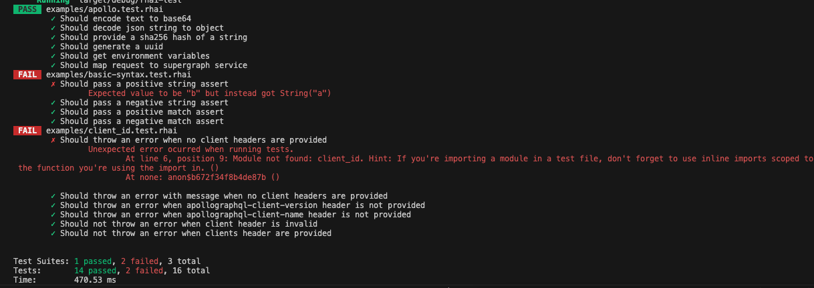

> This is currently non-functional without using a local router build. Please talk to Andrew McGivery if you want to try this out or just get a demo!

# rhai-test

Run `cargo run` to execute all `*.test.rhai` files with their tests.

